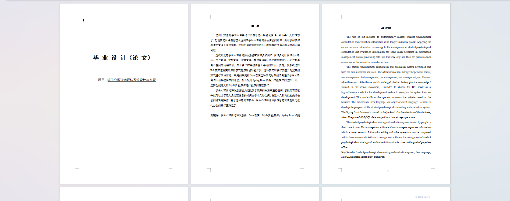
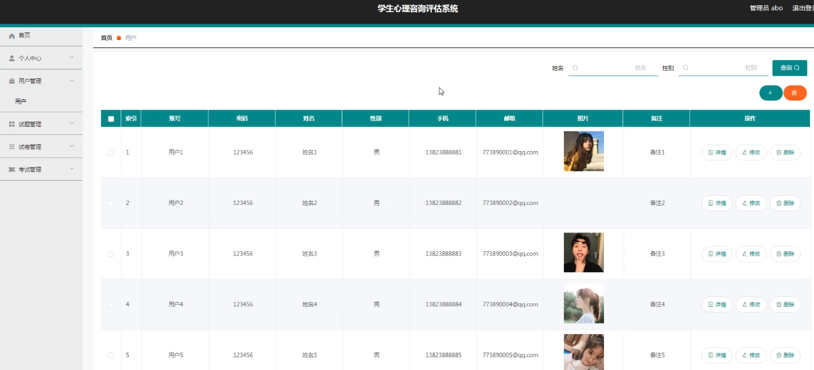
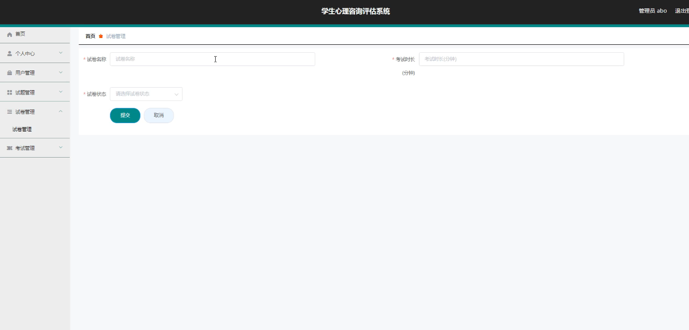
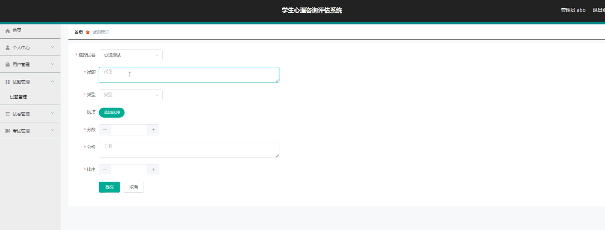
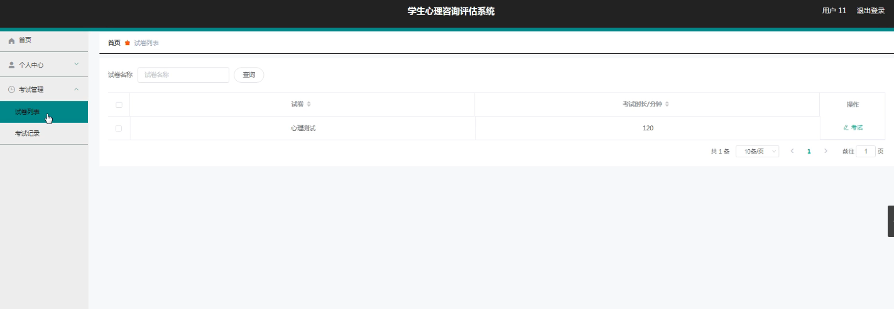
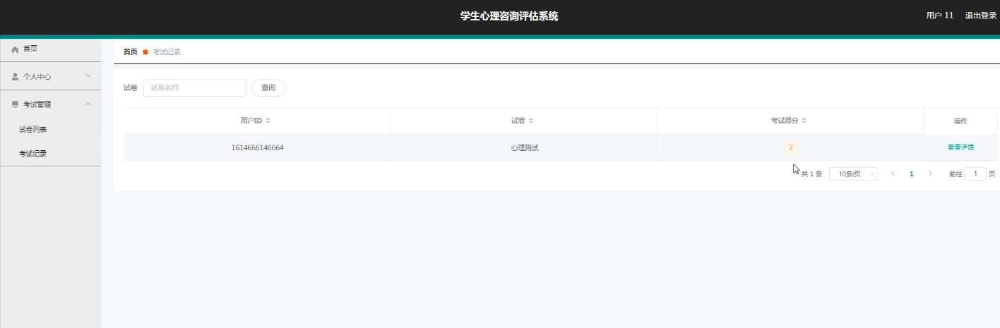

基于Springboot的图书馆管理系统（程序+论文）
=

### 完整代码获取地址：从戎源码网 ([https://armycodes.com/](https://armycodes.com/))
### 作者微信：19941326836  QQ：952045282 
### 承接计算机毕业设计、Java毕业设计、Python毕业设计、深度学习、机器学习
### 选题+开题报告+任务书+程序定制+安装调试+论文+答辩ppt 一条龙服务
### 所有选题地址https://github.com/nature924/allProject

一、项目介绍
---
系统包含两种角色：用户、管理员，系统分为前台和后台两大模块，主要功能如下：

### 1 用户信息管理
管理员功能: 管理员可以添加、修改、删除用户信息。
用户信息管理页面: 展示和操作用户信息的界面。
### 2 试卷信息管理
管理员功能: 管理员可以添加、修改、删除试卷信息。
试卷信息管理页面: 展示和操作试卷信息的界面。
### 3 试题信息管理
管理员功能: 管理员可以添加、修改、删除试题信息。
试题信息管理页面: 展示和操作试题信息的界面。
### 4 试卷列表管理
用户功能: 用户登录后可以查看试卷列表并进行参考考试。
试卷列表管理页面: 展示试卷列表和考试入口的界面。
### 5 考试记录管理
用户功能: 用户可以查看自己的考试记录。
考试记录管理页面: 展示用户考试记录的界面。

二、项目技术
---
- 编程语言：Java
- 数据库：MySQL
- 项目管理工具：Maven
- 前端技术：VUE、HTML、Jquery、Bootstrap
- 后端技术：Spring、SpringMVC、MyBatis

三、运行环境
---
- 操作系统：Windows、macOS都可以
- JDK版本：JDK1.8以上都可以
- 开发工具：IDEA、Ecplise、Myecplise都可以
- 数据库: MySQL5.7以上都可以
- Tomcat：任意版本都可以
- Maven：任意版本都可以

四、运行截图
---
### 论文截图：

### 程序截图：

